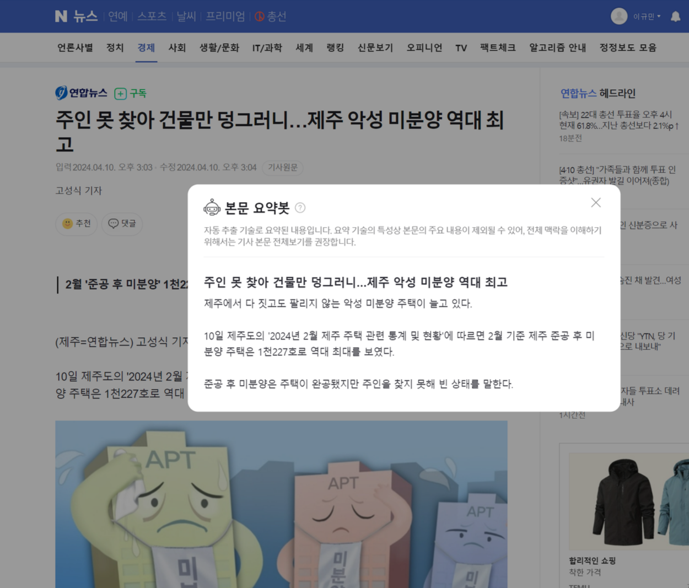
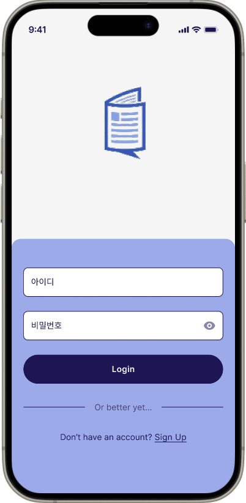
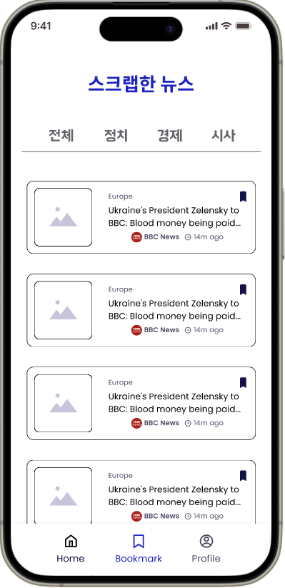
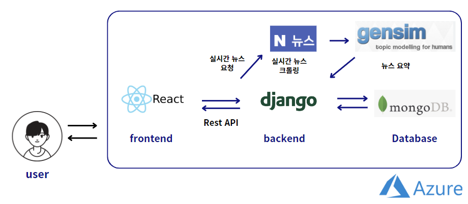

# A1.1 OSS 프로젝트 수행계획서

## 1. 프로젝트 수행팀 개요

- 수행 학기: 2024-1
- 프로젝트명: 스냅뉴스
- 팀명: JCL

| 구분 | 성명 | 학번 | 소속학과 | 연계전공 | 이메일 |
| --- | --- | --- | --- | --- | --- |
| 팀장 | 이규민 | 2021112404 | 산업시스템공학과 | 융합SW연계전공 | kmkm0903@dgu.ac.kr |
| 팀원 | 정영균 | 2017110290 | 일어일문학과 | 데이터사이언스연계전공 | mailto:slowstar916@naver.com |
| 팀원 | 최지안 | 2020112089 | 정보통신공학과 | 융합SW연계전공 | mailto:an032944@daum.net |
- 지도교수: 융합SW교육원 이길섭 교수님, 박효순 교수님

### 2.1 프로젝트 개요

주제: 자유 주제

소개: 바쁜 현대인들을 위한 뉴스 요약 서비스

### 2.2 추진 배경(자료조사 및 요구분석)

### (1) 개발 배경 및 필요성

이 프로젝트의 배경은 현대인들의 바쁜 일상과 정보 과부하에 대응하기 위한 것입니다. 현대 사회에서는 뉴스와 정보에 대한 수요가 계속해서 증가하고 있지만, 바쁜 현대인들은 이를 모두 소비하고 이해하는 것이 어려운 상황에 처해 있습니다. 이에 따라 뉴스 요약 서비스는 더욱 중요한 필요성을 갖고 있기 때문에 저희는 다음과 같은 서비스를 계획하였습니다. 저희 서비스를 통해 사용자들은 짧은 시간 안에 여러 정보들을 빠르게 파악할 수 있습니다. 결과적으로, 사용자들은 시간을 절약하면서도 더 많은 정보를 습득할 수 있게 됩니다.

### (2) 선행기술 및 사례 분석

### 1. 선행 서비스 분석

**네이버 뉴스의 요약봇** 

- 네이버 뉴스에서는 AI 알고리즘을 이용하여 기사의 내용을 짧게 자동으로 추출하는 서비스인 요약봇 서비스를 제공한다. 뉴스 기사를 열람할 때 해당 기사의 요약 내용을 확인할 수 있는 기능을 제공한다.
- 직접 기사를 클릭해서 들어가야 요약을 확인할 수 있다. 하루의 뉴스를 전체적으로 확인하기엔 불편함이 있다.

### 2. 참고 프로젝트 분석

1. 기존 프로젝트: 네이버 뉴스 요약 사이트로 특정 검색어를 입력하면 그에 따른 최신 네이버 뉴스를 요약해서 제공하는 웹 서비스
2. 사용한 Open API:  NAVER 검색(뉴스) API, NAVER Cloud 요약 API
3. 핵심기능
    
    1. 뉴스 검색
    
    네이버 뉴스 검색 api를 통해 입력한 키워드에 맞는 네이버 뉴스를 최신 순으로 가져온다.
    
    2. 뉴스 업데이트
    
    가장 최신 뉴스의 날짜, 제목, 본문을 보여준다.
    
    3. 뉴스 요약
    
    ‘요약하기’ 버튼을 클릭하면 NCloud 요약 api를 사용해 뉴스 본문을 요약한다.
    
    4. 다음 버튼 및 이전 버튼
    
    버튼을 클릭해 다음 or 이전 뉴스를 보여준다.
    

### **3. 차별점 및 개선점**

네이버 뉴스와 비교

| 기존 | 우리 프로젝트 |
| --- | --- |
| 기사별로 요약하기 버튼 클릭해서 요약 | 실시간 요약된 헤드라인 기사 5개 |
| 북마크 기능 X | 북마크 기능 O |

참고 프로젝트와 비교

| 기존 | 우리 프로젝트 |
| --- | --- |
| 기사별로 요약하기 버튼 클릭해서 요약 | 실시간 헤드라인 기사 5개 요약 |
| 북마크 기능 X | 북마크 기능 O |
| 카테고리 구분 X | 카테고리 구분 O |
1. 메인페이지 변경: 뉴스 기사 하나의 요약을 위해 직접 요약 버튼을 누르는 것이 아니라 메인 페이지에서 카테고리별 헤드라인 기사 5개를 요약해서 한 눈에 확인할 수 있다. 사용자는 주요 뉴스를 빠르게 파악할 수 있어 편리하다.
2. 로그인/ 회원가입 페이지 추가: 사용자가 북마크 저장과 같은 개인화된 기능을 이용하기 위해 로그인 및 회원가입 페이지를 추가한다. 
3. 북마크 기능 추가: 요약한 뉴스 중 사용자가 관심 있는 기사를 북마크하여 나중에 다시  확인할 수 있도록 하는 기능이다. 사용자는 북마크한 기사들을 한 곳에 모아서 효율적으로 관리할 수 있다.

### 2.3 목표 및 내용

### (1) 개발 목표

- 요구사항 정의서
    
    
    | 페이지 | 필요 기능 | 기능 설명 |
    | --- | --- | --- |
    | 로그인/회원가입 |  |  |
    | 메인 페이지 | 카테고리 선택하기 | 정치/경제/사회 카테고리로 구분한다. |
    |  | 뉴스 가져오기 | 실시간 뉴스를 가져온다. |
    |  | 요약된 뉴스 보기 | 뉴스 5개를 요약해서 사용자에게 보여준다. |
    |  | 관심 뉴스 스크랩 | 관심있는 뉴스를 스크랩해서 저장할 수 있다. |
    | 뉴스 상세 페이지 | 뉴스 원본 보기 | 원본 뉴스를 보여준다. |
    | 스크랩 페이지 | 저장한 뉴스 보여주기 | 사용자가 스크랩한 뉴스를 모아서 보여준다. |

### (2) 개발 내용

- 화면 설계서

### (3) 대안 도출 및 구현 계획

### (4) 설계의 현실적 제한요소(제약조건)

- 실시간 뉴스를 가져오는 과정에서 ‘네이버 뉴스’ 사이트를 크롤링하는 과정이 필요하기 때문에, 해당 사이트에서 크롤링을 제한할 경우 데이터 수집에 어려움이 발생한다.

### (5) 개발 환경

- 시스템 구성도
    

    
### 2.4 기대효과

1. **효율적인 시간 활용**
- 현대인들의 바쁜 일상 속에서 뉴스를 신속하게 습득할 수 있는 기회를 제공할 것으로 기대된다. 출퇴근 시간이나 짧은 여유 시간에도 뉴스를 확인할 수 있어, 개인의 시간 활용에 대한 효율성이 증가할 것으로 보인다.
1. **인지적 부담 완화**
- 긴 글을 읽는 것에 대한 부담을 감소시킴으로써, 뉴스를 소비하는 데 있어 인지적 부담이 덜어져 사용자들이 더욱 적극적으로 정보를 습득할 수 있게 될 것이다.
1. **효율적인 정보 관리**
- 마이페이지와 스크랩 기능 제공으로, 사용자는 원하는 요약된 뉴스를  모아서 관리할 수 있다.

### 2.5 추진일정

- 세부 작업에 대한 간트차트
- 세부 작업 별 구성원의 역할

| 이규민 | 프론트엔드, 문서관리, 일정관리 |
| --- | --- |
| 최지안 | UI/UX설계, 인프라 설계 |
| 정영균 | 백엔드, DB설계 |

### 2.6 참고문헌

[https://github.com/woorifisa-service-dev-2nd/fronted-2nd-newsSummary](https://github.com/woorifisa-service-dev-2nd/fronted-2nd-newsSummary)

[https://ai-creator.tistory.com/m/36](https://ai-creator.tistory.com/m/36)

### 2.7 성과창출 계획

| 항목 | 세부내용 | 예상(달성)시기 |
| --- | --- | --- |
| Github 등록 | 프로젝트 완성 후 Github 등록 | 2024년6월 |
| 모바일 앱 | 프로젝트 완성 후 모바일 앱 개발 | 2024년7월 |