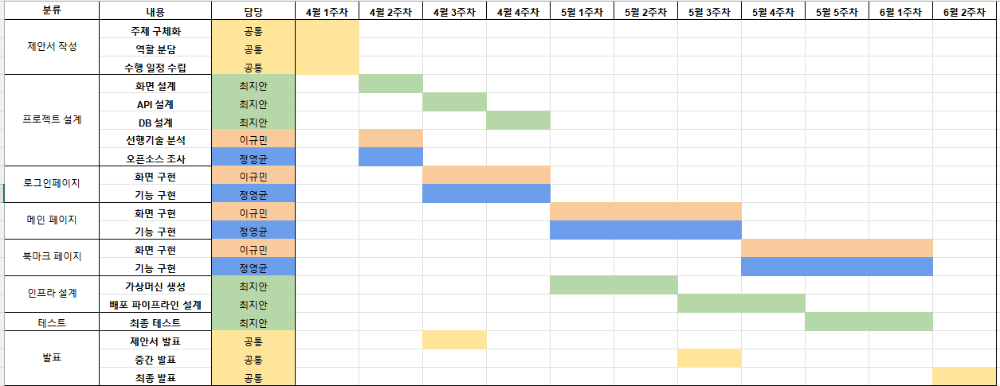

# A3.1 OSS 프로젝트 최종보고서

# **I. 프로젝트 수행팀 개요**

- 수행 학기: 2024-1
- 프로젝트명:
    - 스냅뉴스: 바쁜 현대인들을 위한 뉴스 요약 서비스
- Key Words :
    - 뉴스, 요약, gpt, 크롤링
- 팀명: JCL

| 구분 | 성명 | 학번 | 소속학과 | 연계전공 | 이메일 |
| --- | --- | --- | --- | --- | --- |
| 팀장 | 이규민 | 2021112404 | 산업시스템공학과 | 융합SW연계전공 | kmkm0903@dgu.ac.kr |
| 팀원 | 정영균 | 2017110290 | 일어일문학과 | 융합SW연계전공 | mailto:slowstar916@naver.com |
| 팀원 | 최지안 | 2020112089 | 정보통신공학과 | 데이터사이언스 연계전공 | mailto:an032944@daum.net |
- 지도교수: 융합SW교육원 이길섭 교수님, 박효순 교수님

# **II. 프로젝트 수행 결과**

### **1. 프로젝트 개요**

주제: 자유 주제

소개: 바쁜 현대인들을 위한 뉴스 요약 서비스

(1) 개발 배경 및 필요성

이 프로젝트의 배경은 현대인들의 바쁜 일상과 정보 과부하에 대응하기 위한 것입니다. 현대 사회에서는 뉴스와 정보에 대한 수요가 계속해서 증가하고 있지만, 바쁜 현대인들은 이를 모두 소비하고 이해하는 것이 어려운 상황에 처해 있습니다. 이에 따라 뉴스 요약 서비스는 더욱 중요한 필요성을 갖고 있기 때문에 저희는 다음과 같은 서비스를 계획하였습니다. 저희 서비스를 통해 사용자들은 짧은 시간 안에 여러 정보들을 빠르게 파악할 수 있습니다. 결과적으로, 사용자들은 시간을 절약하면서도 더 많은 정보를 습득할 수 있게 됩니다.

### 2. 선행기술 및 사례 분석

### 1) 선행 서비스 분석

**네이버 뉴스의 요약봇** 

- 네이버 뉴스에서는 AI 알고리즘을 이용하여 기사의 내용을 짧게 자동으로 추출하는 서비스인 요약봇 서비스를 제공한다. 뉴스 기사를 열람할 때 해당 기사의 요약 내용을 확인할 수 있는 기능을 제공한다.
- 직접 기사를 클릭해서 들어가야 요약을 확인할 수 있다. 하루의 뉴스를 전체적으로 확인하기엔 불편함이 있다.


### 2) 참고 프로젝트 분석


1. 기존 프로젝트: 네이버 뉴스 요약 사이트로 특정 검색어를 입력하면 그에 따른 최신 네이버 뉴스를 요약해서 제공하는 웹 서비스
2. 사용한 Open API:  NAVER 검색(뉴스) API, NAVER Cloud 요약 API
3. 핵심기능
    
     1. 뉴스 검색
    
    네이버 뉴스 검색 api를 통해 입력한 키워드에 맞는 네이버 뉴스를 최신 순으로 가져온다.
    
    2. 뉴스 업데이트
    
    가장 최신 뉴스의 날짜, 제목, 본문을 보여준다.
    
    3. 뉴스 요약
    
    ‘요약하기’ 버튼을 클릭하면 NCloud 요약 api를 사용해 뉴스 본문을 요약한다.
    
    4. 다음 버튼 및 이전 버튼
    
    버튼을 클릭해 다음 or 이전 뉴스를 보여준다.
    

### **3) 차별점 및 개선점**

네이버 뉴스와 비교

| 기존 | 우리 프로젝트 |
| --- | --- |
| 기사별로 요약하기 버튼 클릭해서 요약 | 실시간 요약된 헤드라인 기사 5개 |
| 북마크 기능 X | 북마크 기능 O |

참고 프로젝트와 비교

| 기존 | 우리 프로젝트 |
| --- | --- |
| 기사별로 요약하기 버튼 클릭해서 요약 | 실시간 헤드라인 기사 5개 요약 |
| 북마크 기능 X | 북마크 기능 O |
| 카테고리 구분 X | 카테고리 구분 O |
1. 메인페이지 변경: 뉴스 기사 하나의 요약을 위해 직접 요약 버튼을 누르는 것이 아니라 메인 페이지에서 카테고리별 헤드라인 기사 5개를 요약해서 한 눈에 확인할 수 있다. 사용자는 주요 뉴스를 빠르게 파악할 수 있어 편리하다.
2. 로그인/ 회원가입 페이지 추가: 사용자가 북마크 저장과 같은 개인화된 기능을 이용하기 위해 로그인 및 회원가입 페이지를 추가한다. 
3. 북마크 기능 추가: 요약한 뉴스 중 사용자가 관심 있는 기사를 북마크하여 나중에 다시  확인할 수 있도록 하는 기능이다. 사용자는 북마크한 기사들을 한 곳에 모아서 효율적으로 관리할 수 있다.

### 3. 목표 및 내용

### (1) 개발 목표

바쁜 현대인들을 위한 뉴스 요약 서비스

- 사용자 중심의 간단하고 직관적인 인터페이스를 제공한다.
- 정확하고 신속하게 뉴스 요약본을 제공한다.
- 북마크 기능, 카카오톡 전송 등의 개인 맞춤 서비스를 제공한다.

**2. 최종결과물 소개**

- **시스템 기능**
    
    
- 회원가입과 로그인


- 메인페이지


- 북마크 페이지


- 주요 기능 구현하기 위한 방법
    - 크롤링 및 요약
        - 파이썬의 beautifulsoup4 라이브러리를 이용하여 카테고리별 뉴스 정보 크롤링
        - openai 라이브러리를 이용하여 크롤링한 뉴스 요약

```jsx
client = OpenAI(
    api_key=os.environ.get("OPENAI_API_KEY")
)

def summarize_text(text):
    response = client.chat.completions.create(
        model="gpt-3.5-turbo",
        messages=[
            {"role": "user", "content": 
            f"Summarize the following text in Korean, maximum 2 sentences: {text}"}
        ],
        max_tokens=300
    )
    summary = response.choices[0].message.content.strip()
    return summary
```

# **3. 프로젝트 추진 내용**

**3.1 프로젝트 진행과정**



**3.2 프로젝트 구현과정**

- 프로젝트 설계 (블록 다이어그램)


- 프로젝트 구현 과정
    

    
- 이슈 관리


- 서비스 흐름도
    

    
     사용자는 React 라이브러리로 만들어진 웹/앱 환경에서 원하는 기능을 요청한다. 이 중 핵심 기능인 뉴스 요약 기능을 요청할 경우, 해당 요청은 Rest API 형식에 따라 Django Rest Framework로 개발된 서비스 서버로 전달된다. 서버는 클라이언트의 요청을 확인하고, BeautifulSoup 라이브러리에서 제공하는 웹 크롤링 기능을 이용하여 실시간 Naver 헤드라인 뉴스 상위 5개 항목을 읽어온다. 읽어온 정보는 gpt api에 전달되고, 이는 사용자가 미리 저장해 놓은 프롬프트에 따라 본문 길이에 관계없이 2줄로 요약된다. gpt에서 반환된 값은 다시 서버로 전달된다.
    
     사용자가 관심이 있는 뉴스가 있을 경우, ‘북마크’ 기능을 이용하여 이를 db에 별도로 저장해 줄 수 있다. db에 저장된 뉴스는 시간이 지나도 사라지지 않고 계정 별로 고유하게 남아 추후 사용자가 원할 경우, 다시 확인할 수 있도록 한다.
    
- 중간발표 대비 개선사항
    1. 뉴스 요약 API 변경
        
        기존에는 파이썬에서 제공하는 GENSIM  라이브러리를 이용하여서 원문을 요약해주는 방법을 이용하였으나, 이를 이용할 경우, GENSIM 라이브러리는 과거 파이썬 버전에 의존하기 때문에 서비스에서 이용하는 타 라이브러리들과 버전이 충돌한다는 문제가 발생하였다. 또한, GENSIM에서 제공하는 요약 기능에서 조정 가능한 parameter 전체 텍스트 대비 결과 텍스트 요약 비율 밖에 없었기 때문에, 원문이 지나치게 길 경우, 요약된 결과도 길게 나오고, 원문이 짧은 경우에는 문장의 구성도 제대로 갖춰지지 않은 채 결과를 반환하기도 하였다. 그래서 이러한 단점을 개선하고자 gpt3.5-turbo-instruct 모델을 활용하여 뉴스 요약을 진행하였으며, 이 때, 프롬프트 튜닝을 이용하여 원문의 기사를 입력으로 넣어줄 경우, 원문의 길이에 관계없이 이를 2줄 이내로 요약해줄 것을 지시하였다. 이를 통해 우리가 구현하고자 하는 취지에 맞춰 뉴스를 요약할 수 있었다.
        
    
    2. DB 변경
        
        기존에는 로컬 환경에서 MySQL 데이터베이스를 이용하였으나, 테스트 과정에서 팀원 개개인의 노트북 별로 데이터가 다르게 저장되기 때문에 즉각적인 피드백이 어렵다는 단점이 존재하였고, 이를 개선하고자 클라우드 상에서 제공하는 AWS의 RDS 중 MySQL 을 이용하여 데이터베이스를 구축하였다. 그 결과, 보안성, 확장성 등을 향상시킬 수 있었다.
        

# **4. 기대효과**

1. **효율적인 시간 활용**
- 현대인들의 바쁜 일상 속에서 뉴스를 신속하게 습득할 수 있는 기회를 제공할 것으로 기대된다. 출퇴근 시간이나 짧은 여유 시간에도 뉴스를 확인할 수 있어, 개인의 시간 활용에 대한 효율성이 증가할 것으로 보인다.
2. **인지적 부담 완화**
- 긴 글을 읽는 것에 대한 부담을 감소시킴으로써, 뉴스를 소비하는 데 있어 인지적 부담이 덜어져 사용자들이 더욱 적극적으로 정보를 습득할 수 있게 될 것이다.
3. **효율적인 정보 관리**
- 마이페이지와 스크랩 기능 제공으로, 사용자는 원하는 요약된 뉴스를  모아서 관리할 수 있다.

# **5. 팀원 역할**

| 구분 | 성명 | 팀내 역할 |
| --- | --- | --- |
| 팀장 | 이규민 | 프론트엔드, 문서관리, 일정관리 |
| 팀원 | 최지안 | UI/UX설계, 인프라 설계 |
| 팀원 | 정영균 | 백엔드, DB설계 |

# **6. 참고문헌**

- 네이버 뉴스 사이트, https://github.com/woorifisa-service-dev-2nd/fronted-2nd-newsSummary, 2024.01
- ai-creator, 네이버 속보 뉴스 요약 프로젝트 - 웹크롤링 + OpenAPI 활용,  https://ai-creator.tistory.com/m/36, 2020.05.16

# **7. 프로젝트 성과**

| 항목 | 세부내용 | 예상(달성)시기 |
| --- | --- | --- |
| Github 등록 | https://github.com/CSID-DGU/2024-1-OSSProj-JCL-08 | 2024년6월 |