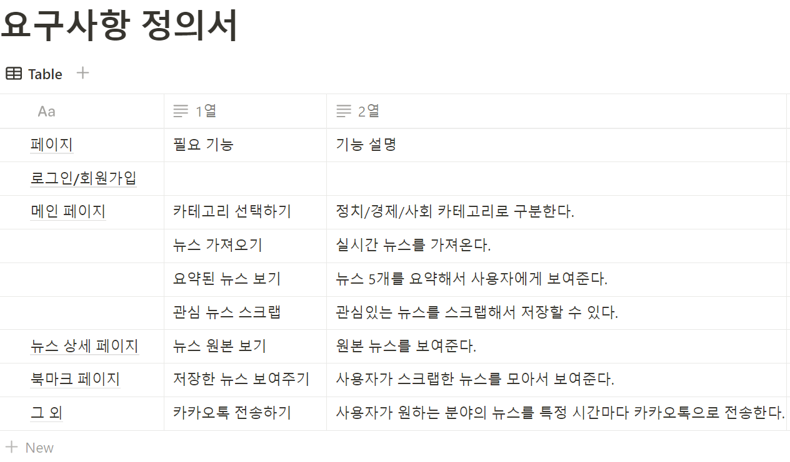

### 2024-1-OSSProj-JCL-08 팀의 리파지토리입니다.

- 팀 구성    
    - (팀장) 이규민
    - (팀원) 정영균 
    - (팀원) 최지안

## 커밋 규칙

- feat : 새로운 기능에 대한 커밋
- fix : 버그 수정에 대한 커밋
- build : 빌드 관련 파일 수정에 대한 커밋
- chore : 그 외 자잘한 수정에 대한 커밋
- docs : 문서 수정에 대한 커밋
- style : 코드 스타일 혹은 포맷 등에 관한 커밋
- refactor : 코드 리팩토링에 대한 커밋

# 프로젝트명 
스냅뉴스: 바쁜 현대인들을 위한 뉴스 요약 서비스

# 기존 시스템과의 차별점 및 개선점

네이버 뉴스와 비교

| 기존 | 우리 프로젝트 |
| --- | --- |
| 기사별로 요약하기 버튼 클릭해서 요약 | 실시간 요약된 헤드라인 기사 5개 |
| 북마크 기능 X | 북마크 기능 O |

참고 프로젝트와 비교

| 기존 | 우리 프로젝트 |
| --- | --- |
| 기사별로 요약하기 버튼 클릭해서 요약 | 실시간 헤드라인 기사 5개 요약 |
| 북마크 기능 X | 북마크 기능 O |
| 카테고리 구분 X | 카테고리 구분 O |
1. 메인페이지 변경: 뉴스 기사 하나의 요약을 위해 직접 요약 버튼을 누르는 것이 아니라 메인 페이지에서 카테고리별 헤드라인 기사 5개를 요약해서 한 눈에 확인할 수 있다. 사용자는 주요 뉴스를 빠르게 파악할 수 있어 편리하다.
2. 로그인/ 회원가입 페이지 추가: 사용자가 북마크 저장과 같은 개인화된 기능을 이용하기 위해 로그인 및 회원가입 페이지를 추가한다. 
3. 북마크 기능 추가: 요약한 뉴스 중 사용자가 관심 있는 기사를 북마크하여 나중에 다시  확인할 수 있도록 하는 기능이다. 사용자는 북마크한 기사들을 한 곳에 모아서 효율적으로 관리할 수 있다.

# 기대 효과
1. **효율적인 시간 활용**
- 현대인들의 바쁜 일상 속에서 뉴스를 신속하게 습득할 수 있는 기회를 제공할 것으로 기대된다. 출퇴근 시간이나 짧은 여유 시간에도 뉴스를 확인할 수 있어, 개인의 시간 활용에 대한 효율성이 증가할 것으로 보인다.
2. **인지적 부담 완화**
- 긴 글을 읽는 것에 대한 부담을 감소시킴으로써, 뉴스를 소비하는 데 있어 인지적 부담이 덜어져 사용자들이 더욱 적극적으로 정보를 습득할 수 있게 될 것이다.
3. **효율적인 정보 관리**
- 마이페이지와 스크랩 기능 제공으로, 사용자는 원하는 요약된 뉴스를  모아서 관리할 수 있다.

# 기술 스택
**OS**

- Microsoft Windows OS

**Code editor**

- VSCode

**Language**

- Python, JavaScript

**Collaboration**

- Notion, Github, Slack, Figma

**License**

- MIT License

**Backend**

- django 23.3.1
- django-restframework 23.3.1
- MySQL 7.5
- GENSIM

**Frontend**

- HTML5, CSS, JavaScript
- React v18.2.0
- Visual Studio Code v1.78.2

**Datebase**

- MongoDB

# 기능 소개

(추후에 추가예정)

# 실행 방법

Frontend
1. npm install
2. npm start

Backend

